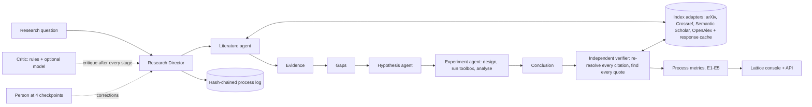
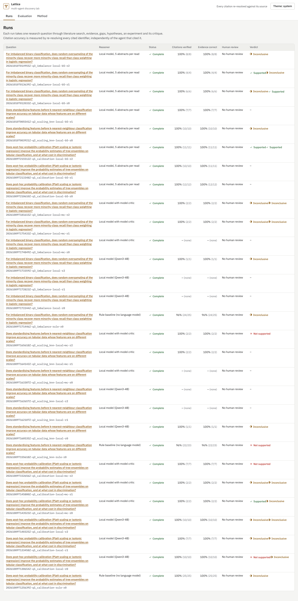
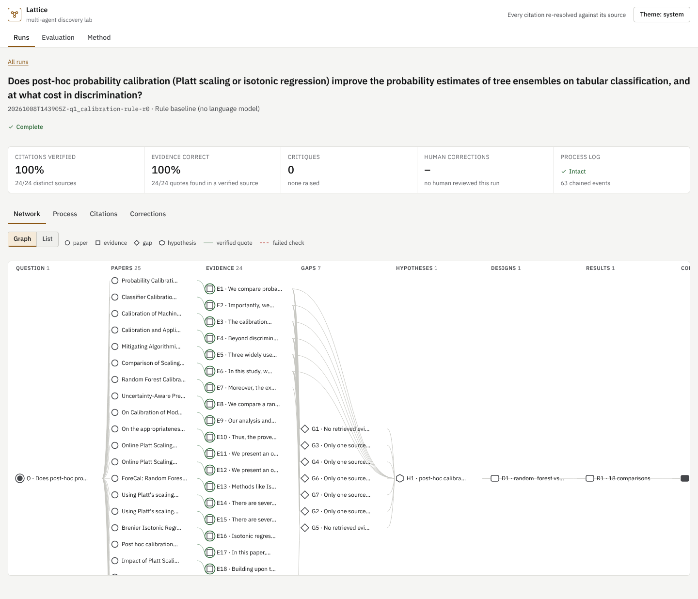
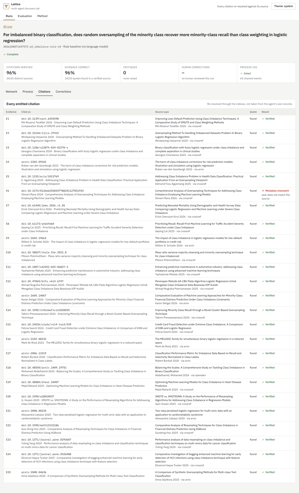
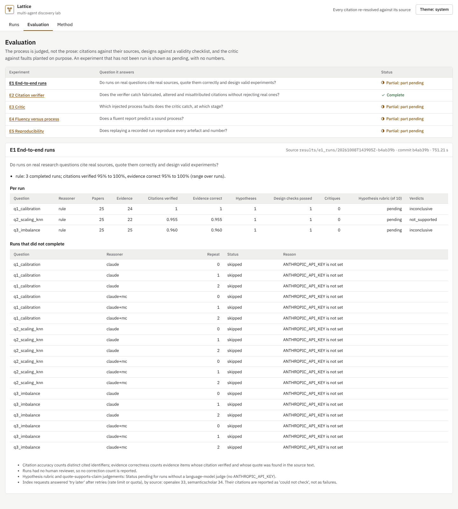

# Multi-agent scientific discovery lab

A Research Director agent takes a research question through literature search, evidence
extraction, gap identification, hypothesis generation, experiment design, analysis and critique.
Literature, Hypothesis, Experiment and Critic agents do the stages; a person can review four
checkpoints. The lab is judged on the **process**, not on how well the report reads: every
citation an agent emits is re-resolved against the real source it names, every quote is looked
for in that source, every experiment is actually run, and every step is in a hash-chained log.

> **Status: in progress.** The rule baseline has run end to end on real literature (arXiv,
> Crossref, Semantic Scholar, OpenAlex) and E1–E5 have results for it
> ([docs/REPORT.md](docs/REPORT.md)). The language-model arms (Claude, Claude with a model critic)
> and the model judges are **Status: pending**: no `ANTHROPIC_API_KEY` was available to this build.
> The project's central comparison has therefore not run yet.

## What is built

| Part | Where | Tested |
|---|---|---|
| Director, Literature, Hypothesis, Experiment and Critic agents over a fixed workflow, with critique rounds after every stage | `src/discoverylab/agents.py` | yes |
| Two reasoners behind one interface: Claude with schema-checked outputs, and a rule baseline with no language model | `src/discoverylab/reasoners/` | yes (Claude with a stub client) |
| Index adapters (OpenAlex, Crossref, arXiv, Semantic Scholar) with a content-addressed response cache and offline replay | `src/discoverylab/literature/` | yes, offline |
| Independent citation verifier: identifier resolution, title, first author, year, verbatim quote | `src/discoverylab/verify.py` | yes |
| Experiment toolbox: bundled datasets, models, calibration and imbalance modifiers, cross-validation, bootstrap intervals, paired tests with Holm correction | `src/discoverylab/toolbox.py` | yes |
| Rule critic (structural faults) and an optional model critic | `src/discoverylab/critic.py` | yes |
| Human checkpoints (evidence, hypotheses, design, conclusion) with logged corrections | `src/discoverylab/human.py` | yes |
| Hash-chained process log and its verifier | `src/discoverylab/log.py` | yes |
| Process metrics, hypothesis rubric judge, quote-support judge | `evaluate.py`, `judges.py` | yes (judge with a stub) |
| Experiments E1–E5 with versioned results and provenance | `src/discoverylab/experiments/` | yes; rule-baseline results in `results/`, model arms pending |
| "Lattice" console: the research network as a knowledge graph, node inspector, process log, citation table, corrections | `web/` | browser, keyboard and axe tests |
| API with rate limiting; token required for writes and for any non-loopback host | `src/discoverylab/api.py` | yes |

## Architecture



Agents never verify their own citations: the verifier re-resolves each identifier through the
indexes after the run (DECISIONS D2). Every index response is cached with its retrieval time, and
each run records which version it consumed, so runs replay exactly (D8, D13).

## Quick start

Requires Python 3.13 with [uv](https://docs.astral.sh/uv/) and Node 22.

```bash
make setup          # uv sync --locked; npm ci
make test           # 43 offline tests
make test-ui        # 27 browser and accessibility tests (needs Chromium)
cp .env.example .env
make serve          # console and API on http://127.0.0.1:8000
```

A run on a real question (needs network access to the indexes; about 4 minutes for the rule baseline):

```bash
uv run discoverylab run configs/questions/q1_calibration.yaml                      # rule baseline
uv run discoverylab run configs/questions/q1_calibration.yaml --reasoner claude --model-critic
uv run discoverylab run configs/questions/q1_calibration.yaml --human review.json  # pause at checkpoints
uv run discoverylab verify-log runs/<run_id>
```

The experiments, in order (E2–E5 build on E1's runs; E3 and E5 are offline):

```bash
make e1 e2 e3 e5 e4   # E1 records the literature cache; E2, E3 and E5 are then offline
make results          # docs/generated/results.md from results/*/LATEST
make screenshots      # docs/screenshots from the latest E1 runs
```

## Research questions

| | Question | Experiment | Status |
|---|---|---|---|
| RQ1 | Do runs on real questions cite real sources, quote them correctly and design valid experiments? | E1, three questions × rule / Claude / Claude with model critic | rule: done; Claude: pending |
| RQ2 | Does the verifier reject fabricated, altered and misattributed citations without rejecting real ones? | E2, 7 corruption types and 4 benign variants | done |
| RQ3 | Which process faults does the critic catch, and which can it not see? | E3, 12 structural and 3 semantic faults | rule critic: done; model critic: pending |
| RQ4 | Does a fluent report predict a sound process? | E4, corrupted report variants: readability, judged convincingness, process score | readability: done; judge: pending |
| RQ5 | Does replaying a recorded run reproduce every artefact? | E5, offline replay from the cache and model transcripts | rule runs: done; model transcripts: pending |

Metric definitions: [docs/METRICS.md](docs/METRICS.md). Plan and risks: [docs/PLAN.md](docs/PLAN.md).
Design: [docs/DESIGN.md](docs/DESIGN.md). Decisions: [docs/DECISIONS.md](docs/DECISIONS.md).
Data and licences: [data/DATASET.md](data/DATASET.md).

## Results (rule baseline)

All numbers are from [docs/generated/results.md](docs/generated/results.md); method, error
analysis and threats to validity are in [docs/REPORT.md](docs/REPORT.md).

| | Result |
|---|---|
| E1 | 3/3 runs complete on real literature, 25 papers each; citations verified 24/24, 21/22, 24/25; every design passed the validity checks. The two failures are real papers the verifier rejected: online-first vs issue year, and an author missing at Crossref. |
| E2 | Verifier rejected 482/482 corruptions and 0/273 benign variants (755 variations of 69 verified items). |
| E3 | Rule critic caught 72/72 structural faults and 0/18 semantic faults; no false critique on unmodified runs. |
| E4 | Readability vs process score: Spearman 0.04 over 15 reports; fabricating citations did not lower readability. |
| E5 | 3/3 runs replayed offline with every artefact and the verification identical (after the fix in DECISIONS D13; the first E5 measured 0/3). |

Verified is not relevant: the rule baseline's verified evidence is often only lexically related
to the question (REPORT §3). Whether a language-model reasoner does better is the pending
comparison.

## Screenshots

From the running console, serving the E1 runs above (`make screenshots`).

| | |
|---|---|
|  |  |
|  |  |

Dark theme and mobile versions are in [docs/screenshots](docs/screenshots).

## Limits that hold by design

- A verified citation shows that the source exists, matches its stated metadata and contains the quote. Whether the quote supports the claim is a separate, judged metric.
- Abstracts are the only source text, so a correct quote from a paper's body is reported as not found.
- Agents can only run experiments the toolbox supports; that keeps every number honest and limits which questions can be tested.
- The rule baseline uses a person-written operationalisation of each question, so its designs are not its own reasoning.

## Future work

- Run the Claude and Claude-with-model-critic arms of E1 (3 repeats each) and the model judges
  (E1 rubric, E3 model critic, E4 convincingness); configs are in `configs/experiments/`.
- A run with a person at the four review checkpoints, so correction counts exist.
- Index-aware year and author checks (online-first dates; falling back to the next resolver when
  the first has no author), evaluated on new data, not on the two cases that motivated them.

## Security

- No credentials in the code or history; configuration through environment variables (`.env.example`).
- The API refuses to bind a non-loopback host without `DISCOVERYLAB_API_TOKEN`, rate-limits every client, and requires the token for every write.
- Strict security headers and a same-origin content security policy on the console.
- Model prompts and answers are kept in each run's transcript; API keys are never logged.

## Licence

MIT. See [LICENSE](LICENSE) and [CITATION.cff](CITATION.cff).
