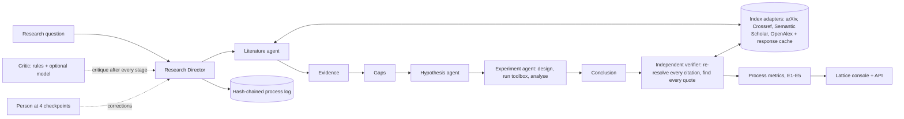
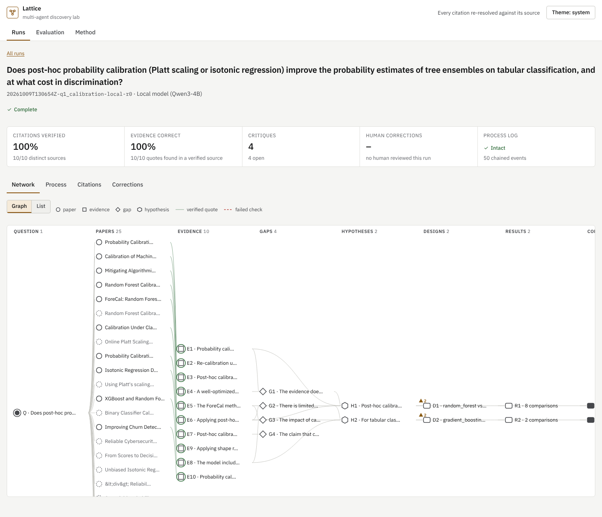
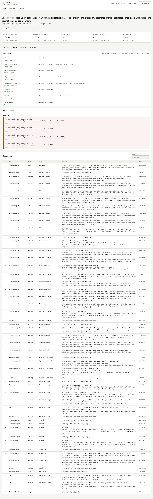

# Multi-agent scientific discovery lab

A Research Director agent takes a research question through literature search, evidence
extraction, gap identification, hypothesis generation, experiment design, analysis and critique.
Literature, Hypothesis, Experiment and Critic agents do the stages; a person can review four
checkpoints. The lab is judged on the **process**, not on how well the report reads: every
citation an agent emits is re-resolved against the real source it names, every quote is looked
for in that source, every experiment is actually run, and every step is in a hash-chained log.

> **Status: complete with local models.** E1–E5 have run end to end on real literature (arXiv,
> Crossref, Semantic Scholar, OpenAlex) for a rule baseline and three language-model arms
> ([docs/REPORT.md](docs/REPORT.md)). The language-model agents, model critic and judges ran on
> **local open-weights models** (Qwen3-4B-Instruct-2507 as agents and critic, Phi-4-mini-instruct
> as judge, both 4-bit on the CPU), because no Anthropic API key was available
> ([DECISIONS D17](docs/DECISIONS.md)). The Claude arms are configured and **Status: pending**.

## What is built

| Part | Where | Tested |
|---|---|---|
| Director, Literature, Hypothesis, Experiment and Critic agents over a fixed workflow, with critique rounds after every stage | `src/discoverylab/agents.py` | yes |
| Reasoners behind one interface: a language-model reasoner with schema-checked outputs (Claude, or a local GGUF model through llama.cpp), and a rule baseline with no language model | `src/discoverylab/reasoners/` | yes (stub clients); local model run in E1 |
| Index adapters (OpenAlex, Crossref, arXiv, Semantic Scholar) with a content-addressed response cache and offline replay | `src/discoverylab/literature/` | yes, offline |
| Independent citation verifier: identifier resolution, title, first author, year, verbatim quote | `src/discoverylab/verify.py` | yes |
| Experiment toolbox: bundled datasets, models, calibration and imbalance modifiers, cross-validation, bootstrap intervals, paired tests with Holm correction | `src/discoverylab/toolbox.py` | yes |
| Rule critic (structural faults) and an optional model critic | `src/discoverylab/critic.py` | yes |
| Human checkpoints (evidence, hypotheses, design, conclusion) with logged corrections | `src/discoverylab/human.py` | yes |
| Hash-chained process log and its verifier | `src/discoverylab/log.py` | yes |
| Process metrics, hypothesis rubric judge, quote-support judge | `evaluate.py`, `judges.py` | yes (stub); local judge run in E1 and E4 |
| Experiments E1–E5 and the E1 arm comparison, with versioned results and provenance (commit, config, package versions, model hashes) | `src/discoverylab/experiments/` | yes; results in `results/` |
| "Lattice" console: the research network as a knowledge graph, node inspector, process log, citation table, corrections | `web/` | browser, keyboard and axe tests |
| API with rate limiting; token required for writes and for any non-loopback host | `src/discoverylab/api.py` | yes |

## Architecture



Agents never verify their own citations: the verifier re-resolves each identifier through the
indexes after the run (DECISIONS D2). Every index response is cached with its retrieval time, and
each run records which version it consumed, so runs replay exactly (D8, D13).

## Quick start

Requires Python 3.13 with [uv](https://docs.astral.sh/uv/) and Node 22.

```bash
make setup          # uv sync --locked; npm ci
make test           # 52 offline tests
make test-ui        # 27 browser and accessibility tests (needs Chromium)
cp .env.example .env
make serve          # console and API on http://127.0.0.1:8000
make setup-local models   # optional: llama-cpp-python and the local model weights (4.9 GB, hash-checked)
```

A run on a real question (needs network access to the indexes; about 3 minutes for the rule
baseline, about 15 for the local model on four CPU cores):

```bash
uv run discoverylab run configs/questions/q1_calibration.yaml                      # rule baseline
uv run discoverylab run configs/questions/q1_calibration.yaml --reasoner local-b5 --model-critic local
uv run discoverylab run configs/questions/q1_calibration.yaml --reasoner claude --model-critic claude  # needs ANTHROPIC_API_KEY
uv run discoverylab run configs/questions/q1_calibration.yaml --human review.json  # pause at checkpoints
uv run discoverylab verify-log runs/<run_id>
```

The experiments, in order (E2–E5 build on E1's runs; E3 and E5 are offline):

```bash
make e1 e1-compare e2 e3 e4 e5   # E1 records the literature cache; the rest are then offline
make results          # docs/generated/results.md from results/*/LATEST
uv run python scripts/error_analysis.py   # docs/generated/error_analysis.md
make screenshots      # docs/screenshots from the latest E1 runs
```

## Research questions

| | Question | Experiment | Status |
|---|---|---|---|
| RQ1 | Do runs on real questions cite real sources, quote them correctly and design valid experiments? | E1 and E1 compare: three questions × rule / local / local + model critic / local reading 5 abstracts per call (3 repeats each) | done; Claude arms pending |
| RQ2 | Does the verifier reject fabricated, altered and misattributed citations without rejecting real ones? | E2, 7 corruption types and 4 benign variants | done |
| RQ3 | Which process faults does the critic catch, and which can it not see? | E3, 12 structural and 3 semantic faults; rule critic and local model critic | done |
| RQ4 | Does a fluent report predict a sound process? | E4, corrupted report variants: readability, judged convincingness, process score | done |
| RQ5 | Does replaying a recorded run reproduce every artefact? | E5, offline replay from the cache and model transcripts | done |

Metric definitions: [docs/METRICS.md](docs/METRICS.md). Plan and risks: [docs/PLAN.md](docs/PLAN.md).
Design: [docs/DESIGN.md](docs/DESIGN.md). Decisions: [docs/DECISIONS.md](docs/DECISIONS.md).
Data and licences: [data/DATASET.md](data/DATASET.md).

## Results

All numbers are from [docs/generated/results.md](docs/generated/results.md) and
[docs/generated/error_analysis.md](docs/generated/error_analysis.md); method, error analysis and
threats to validity are in [docs/REPORT.md](docs/REPORT.md). "Local" is a 4B open model, not the
frontier model the study was designed for.

| | Result |
|---|---|
| E1 | 29 runs complete on real literature (1 failed). Every citation and quote from the local model verified (100% in 26 runs); the rule baseline 97% (two real papers with disagreeing metadata). The local model found far less evidence (3.2 items per run against 24.3; 8.6 when reading 5 abstracts per call), 14 of its 40 designs named things the toolbox does not have, and 7 of 26 verdicts differed from the statistics. The model critic did not change any metric by more than its spread. |
| E2 | Verifier rejected 1035/1035 corruptions and 0/584 benign variants (1,619 variations of 148 verified items). |
| E3 | Rule critic caught 578/578 structural faults and 0/201 semantic ones. The local model critic flagged 8/40 structural and 2/12 semantic faults: a complement on meaning, not a substitute. |
| E4 | Over 103 rated reports, readability vs process score: Spearman 0.08; judged convincingness vs process score: −0.37. Corrupted reports were judged *more* convincing (7.1 of 10 with every corruption against 5.2 for the originals). |
| E5 | 29/29 runs, rule and model, replayed offline with every artefact and the verification identical. |

Verified is not relevant: a verified citation exists and contains its quote, which says nothing
about whether it bears on the question (REPORT §3).
## Screenshots

From the running console, serving the E1 runs above (`make screenshots`).

| | |
|---|---|
|  |  |
|  |  |
|  |  |

Dark theme and mobile versions are in [docs/screenshots](docs/screenshots).

## Limits that hold by design

- A verified citation shows that the source exists, matches its stated metadata and contains the quote. Whether the quote supports the claim is a separate, judged metric.
- Abstracts are the only source text, so a correct quote from a paper's body is reported as not found.
- Agents can only run experiments the toolbox supports; that keeps every number honest and limits which questions can be tested.
- The rule baseline uses a person-written operationalisation of each question, so its designs are not its own reasoning.

## Future work

- Run the Claude and Claude-with-model-critic arms of E1 (configured in
  `configs/experiments/e1_runs.yaml`; they need `ANTHROPIC_API_KEY`) and a larger judge, to
  separate what a model critic cannot do from what a 4B model cannot do.
- A run with a person at the four review checkpoints, so correction counts exist.
- Index-aware year and author checks (online-first dates; falling back to the next resolver when
  the first has no author), evaluated on new data, not on the two cases that motivated them.
- Design validity by meaning rather than exact metric name (REPORT §3, error analysis).

## Security

- No credentials in the code or history; configuration through environment variables (`.env.example`).
- The API refuses to bind a non-loopback host without `DISCOVERYLAB_API_TOKEN`, rate-limits every client, and requires the token for every write.
- Strict security headers and a same-origin content security policy on the console.
- Model prompts and answers are kept in each run's transcript; API keys are never logged.

## Licence

MIT. See [LICENSE](LICENSE) and [CITATION.cff](CITATION.cff).
